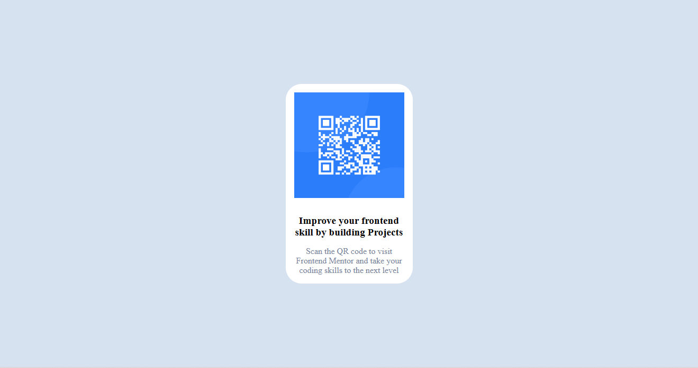
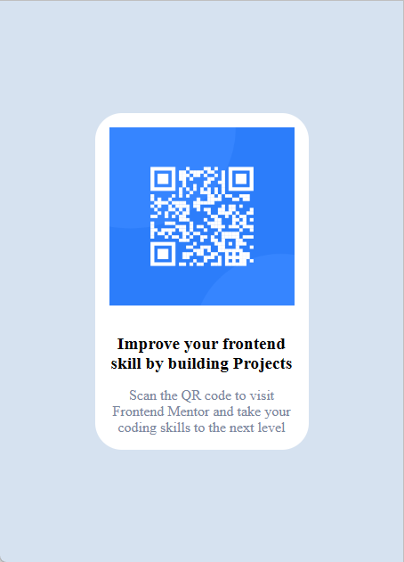

# Frontend Mentor - QR code component solution

This is a solution to the [QR code component challenge on Frontend Mentor](https://www.frontendmentor.io/challenges/qr-code-component-iux_sIO_H). Frontend Mentor challenges help you improve your coding skills by building realistic projects. 

## Table of contents
  - [Screenshot](#screenshot)
  - [Links](#links)
  - [Built with](#built-with)
  - [Continued development](#continued-development)
  - [Useful resources](#useful-resources)
- [Author](#author)

### Screenshot

### Built with

- Semantic HTML5 markup
- CSS custom properties
- Flexbox
- Media query

### Continued development

The media query was quite challenging. Confusing at first. I would really love to build and learn more about it in my future projects for a better reponsiveness in my projects.

### Useful resources

- [W3school](https://www.W3school.com) - This helped me for achieving my media query. I really liked this pattern and will use it going forward.

## Author

- Website - no website for now
- Frontend Mentor - [@Ozioma45](https://www.frontendmentor.io/profile/Ozioma45)
- Twitter - [@EgoleOzioma](https://www.twitter.com/EgoleOzioma)